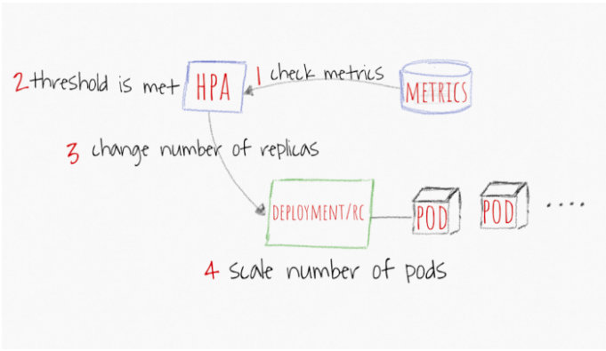

# k8s-nodejs

## Task
Write all necessary Kubernetes files to deploy a simple NodeJS process to the cluster.

## General
All .yaml files create the required deployment.

I have concatinated all .yaml files in the correct applying order using kustomization.yaml

```
apiVersion: kustomize.config.k8s.io/v1beta1
kind: Kustomization
resources:
  - namespace.yaml
  - secrets.yaml
  - deployment.yaml
  - service.yaml
  - hpa.yaml
```

## Execution

Run the following commands to apply all .yaml files:

*kubectl kustomization . > allInOne.yaml*

*kubectl apply -f allInOne.yaml*


# Entire Solution Overview
## Switch to *api-servers* namespace

*kubectl config set-context --current --namespace=api-servers*

## Present complete solution

*kubectl get all*

```
NAME                                 READY   STATUS             RESTARTS   AGE
pod/nodejs-deploy-8598bb797b-4m6j4   0/1     ErrImagePull       0          4h1m
pod/nodejs-deploy-8598bb797b-bxbd6   0/1     ImagePullBackOff   0          4h1m

NAME                    TYPE           CLUSTER-IP     EXTERNAL-IP                                                              PORT(S)        AGE
service/nodejs-deploy   LoadBalancer   100.68.31.81   a51fe584f628b4a68a3d35fd680c65bc-112392756.us-east-1.elb.amazonaws.com   80:32103/TCP   4h1m

NAME                            READY   UP-TO-DATE   AVAILABLE   AGE
deployment.apps/nodejs-deploy   0/2     2            0           4h1m

NAME                                       DESIRED   CURRENT   READY   AGE
replicaset.apps/nodejs-deploy-8598bb797b   2         2         0       4h1m

NAME                                                REFERENCE                  TARGETS         MINPODS   MAXPODS   REPLICAS   AGE
horizontalpodautoscaler.autoscaling/nodejs-deploy   Deployment/nodejs-deploy   <unknown>/80%   2         10        2          4h1m
```

### Notes

- No need to use a real repo.
- No need to build the docker image 
  Thus, Docker image “nodejs-api” will not be pulled (ErrImagePull)


# Requirements & Details

1. The API should be accessible inside the cluster on port 8000.
   * deployment.yaml: .spec.template.spec.containers.ports.containerPort=8000
   * service.yaml: .spec.ports.targetPort=8000
     (As shown above, AWS provides the ELB loadBalancer)

2. The API should be accessible from outside the cluster on port 80
   * service.yaml: .spec.ports.port=80
   * service.yaml: .spec.type=LoadBalancer
   (Ingress is also an option with relevant configuration, but ingress is used to use a single LoadBalancer for many services
    Since here I only have a single service, then I can use type:LoadBalancer)

   

3. Minimum of 2 replicas and max unavailable 2.
   * When we use the HPA we need to remove the number of replicas of the deployment, pod, replicaset.<br/>
     Because the number of replicas is set by the HPA Controller. 
     hpa.yaml: .spec.minReplicas=2
     
   
     
   * deployment.yaml: .spec.strategy.type: RollingUpdate
   * deployment.yaml: .spec.strategy.rollingUpdate.maxUnavailable=2
     (An optional field that specifies the maximum number of Pods that can be unavailable during the update process)


4.  Reference for secret file: “docker-registry-secret” (assume that secret is already exists).
    * **docker-registry-secret.txt**
    
      I have create docker-registry-secret.txt file locally -> includes a single password inside.
    
         
    ```   
    [root@shlomime k8s]# cat docker-registry-secret 
    #!@VeryStr0ngSecret1!#
    ```


    * **secret.yaml & db-secrets**
    
      I encrepted the password in base64 and transfered it into *secret.yaml*
   
      *kubectl create secret generic db-secrets --from-file=./docker-registry-secret -o yaml --namespace=api-servers*

     ```
     [root@shlomime k8s]# kubectl get secrets 
     NAME                   TYPE                                  DATA   AGE
     db-secrets             Opaque                                1      12s
     ```
       {Another option was to set the docker-registry-secret.txt file outside the cluster and use volume attachement.}
      

     * **deployment.yaml & secret.yaml**
     
       In deployment.yaml, I configured an env section which sets the above password as a env parameter.
     
       Bellow you can see that the container gets the env parameter (when replacing the nodejs-api image with nginx image).
     
    ```
    [root@shlomime k8s]# kubectl get pod
    NAME                         READY   STATUS    RESTARTS   AGE
    my-deploy-848d7d4865-4rmjn   1/1     Running   0          51s
    my-deploy-848d7d4865-nsn9h   1/1     Running   0          51s
    [root@shlomime k8s]# 
    [root@shlomime k8s]# 
    [root@shlomime k8s]# kubectl exec -it my-deploy-848d7d4865-4rmjn bash
    kubectl exec [POD] [COMMAND] is DEPRECATED and will be removed in a future version. Use kubectl exec [POD] -- [COMMAND] instead.
    root@my-deploy-848d7d4865-4rmjn:/# echo $SECRET_PASSWORD
    #!@VeryStr0ngSecret1!#
    root@my-deploy-848d7d4865-4rmjn:/# 
    ```

      

5. The pod should belong to the “api-servers” namespace.
   * Relevant file: namespace.yaml
   * All .yaml files include *namespace: api-server* in metadata.
   
   
6. The API will horizontally auto-scale when the CPU reaches 80%.
   * Pre-request: Verify that metrics-server is installed: <br/>
     *kubectl get deployment metrics-server -n kube-system*  
     
   * hpa.yaml: .apiVersion=autoscaling/v2beta2 <br/>
     hpa.yaml: .spec.metrics...averageUtilization=80


